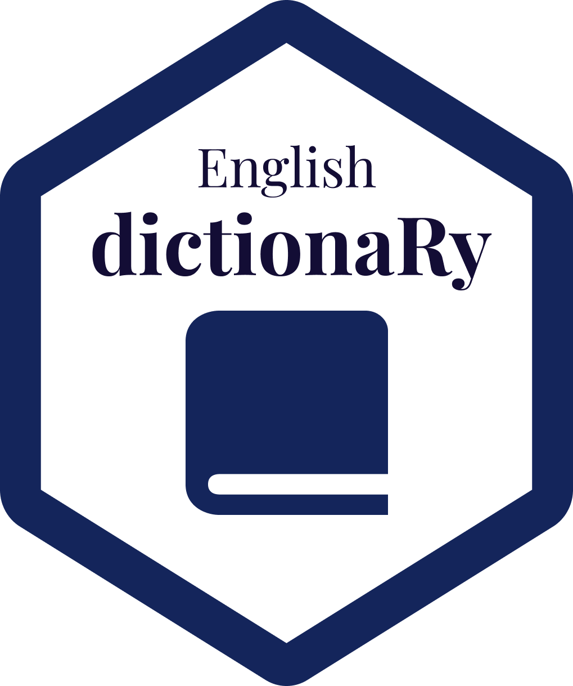

# dictionaRy <a href='https://github.com/stevecondylios/dictionaRy'></a>

<!-- badges: start -->

[](https://cran.r-project.org/package=dictionaRy)
<!-- badges: end -->

Retrieve the dictionary definition of English words in tidy format,
along with their phonetics, audio pronunciation, parts of speech,
origins, examples, synonyms, and antonyms.

### Installation

Installation via GitHub
`devtools::install_github("stevecondylios/dictionaRy")`

``` r
# install.packages("devtools")
devtools::install_github("stevecondylios/dictionaRy")
```

Future: Installation via CRAN `install.packages("dictionaRy")`

``` r
install.packages("dictionaRy")
```

## Usage

Load library

``` r
library(dictionaRy)
library(tidyverse)
```

Get information for the word “hello”:

``` r
word <- "hello"
(word_info <- define(word))
```

    ## # A tibble: 3 x 11
    ##   original word  meaning_number part_of_speech phonetic audio  origin definition
    ##   <chr>    <chr>          <int> <chr>          <chr>    <chr>  <chr>  <chr>     
    ## 1 hello    hello              1 exclamation    həˈləʊ   https… early… used as a…
    ## 2 hello    hello              1 noun           həˈləʊ   https… early… an uttera…
    ## 3 hello    hello              1 verb           həˈləʊ   https… early… say or sh…
    ## # … with 3 more variables: example <chr>, synonyms <I<list>>,
    ## #   antonyms <I<list>>

### Definitions and parts of speech

``` r
word_info %>% 
  select(part_of_speech, definition)
```

    ## # A tibble: 3 x 2
    ##   part_of_speech definition                                          
    ##   <chr>          <chr>                                               
    ## 1 exclamation    used as a greeting or to begin a phone conversation.
    ## 2 noun           an utterance of ‘hello’; a greeting.                
    ## 3 verb           say or shout ‘hello’.

### Word origins

``` r
word_info %>% 
  select(origin)
```

    ## # A tibble: 3 x 1
    ##   origin                                                          
    ##   <chr>                                                           
    ## 1 early 19th century: variant of earlier hollo ; related to holla.
    ## 2 early 19th century: variant of earlier hollo ; related to holla.
    ## 3 early 19th century: variant of earlier hollo ; related to holla.

### Example word usage

``` r
word_info %>% 
  select(example)
```

    ## # A tibble: 3 x 1
    ##   example                                           
    ##   <chr>                                             
    ## 1 hello there, Katie!                               
    ## 2 she was getting polite nods and hellos from people
    ## 3 I pressed the phone button and helloed

### Phonetics

``` r
word_info %>% 
  select(phonetic)
```

    ## # A tibble: 3 x 1
    ##   phonetic
    ##   <chr>   
    ## 1 həˈləʊ  
    ## 2 həˈləʊ  
    ## 3 həˈləʊ

### Audio pronunciation

Visit the urls to hear the word spoken.

``` r
word_info %>% 
  select(audio)
```

    ## # A tibble: 3 x 1
    ##   audio                                                                     
    ##   <chr>                                                                     
    ## 1 https://ssl.gstatic.com/dictionary/static/sounds/20200429/hello--_gb_1.mp3
    ## 2 https://ssl.gstatic.com/dictionary/static/sounds/20200429/hello--_gb_1.mp3
    ## 3 https://ssl.gstatic.com/dictionary/static/sounds/20200429/hello--_gb_1.mp3

<hr>

### Technical details on the relationship between word meanings, parts of speech, and definitions

-   A **word** that is found in the English dictionary may have one or
    more **meaning**s

    -   each **meaning** can have one or more **parts of speech**.
    -   each combination of **meaning** and **part of speech** will have
        one or more **definitions**.

-   Example: the word *bark* has 4 meanings. Take the first meaning: a
    dog’s bark. This meaning has 2 parts of speech (*noun* and *verb*).
    The noun has 1 definition
    `the sharp explosive cry of a dog, fox, or seal`.  
    The verb has 2 definitions `(of a dog, fox, or seal) give a bark`
    and `utter (a command or question) abruptly or aggressively`. So we
    have a total of 3 definitions just for the first of four meanings of
    ‘bark’ (and more for the second, third, and fourth).

-   If a word cannot be found in the English dictionary a 0-row tibble
    will be returned, and message to that effect printed to the console
    (e.g.  `define("sdlkfjsldkjf")`).

<hr>

### More examples

“hello”

``` r
define("hello")
```

    ## # A tibble: 3 x 11
    ##   original word  meaning_number part_of_speech phonetic audio  origin definition
    ##   <chr>    <chr>          <int> <chr>          <chr>    <chr>  <chr>  <chr>     
    ## 1 hello    hello              1 exclamation    həˈləʊ   https… early… used as a…
    ## 2 hello    hello              1 noun           həˈləʊ   https… early… an uttera…
    ## 3 hello    hello              1 verb           həˈləʊ   https… early… say or sh…
    ## # … with 3 more variables: example <chr>, synonyms <I<list>>,
    ## #   antonyms <I<list>>

“bark”

``` r
define("bark")
```

    ## # A tibble: 9 x 11
    ##   original word   meaning_number part_of_speech phonetic audio origin definition
    ##   <chr>    <chr>           <int> <chr>          <chr>    <chr> <chr>  <chr>     
    ## 1 bark     bark                1 noun           bɑːk     http… Old E… the sharp…
    ## 2 bark     bark                1 verb           bɑːk     http… Old E… (of a dog…
    ## 3 bark     bark                1 verb           bɑːk     http… Old E… utter (a …
    ## 4 bark     bark                2 noun           bɑːk     http… Middl… the tough…
    ## 5 bark     bark                2 noun           bɑːk     http… Middl… thin shee…
    ## 6 bark     bark                2 verb           bɑːk     http… Middl… strip the…
    ## 7 bark     bark                2 verb           bɑːk     http… Middl… tan or dy…
    ## 8 bark     bark                3 noun           bɑːk     http… late … a ship or…
    ## 9 bark     barque              4 noun           bɑːk     http… Middl… a sailing…
    ## # … with 3 more variables: example <chr>, synonyms <I<list>>,
    ## #   antonyms <I<list>>

“set” (..is said to have more meanings than any other English word!)

``` r
define("set")
```

    ## # A tibble: 25 x 11
    ##    original word  meaning_number part_of_speech phonetic audio origin definition
    ##    <chr>    <chr>          <int> <chr>          <chr>    <chr> <chr>  <chr>     
    ##  1 set      set                1 verb           sɛt      http… Old E… put, lay,…
    ##  2 set      set                1 verb           sɛt      http… Old E… put or br…
    ##  3 set      set                1 verb           sɛt      http… Old E… adjust (a…
    ##  4 set      set                1 verb           sɛt      http… Old E… harden in…
    ##  5 set      set                1 verb           sɛt      http… Old E… (of the s…
    ##  6 set      set                1 verb           sɛt      http… Old E… (of a tid…
    ##  7 set      set                1 verb           sɛt      http… Old E… start (a …
    ##  8 set      set                1 verb           sɛt      http… Old E… (of bloss…
    ##  9 set      set                1 verb           sɛt      http… Old E… sit.      
    ## 10 set      set                2 noun           sɛt      http… late … a group o…
    ## # … with 15 more rows, and 3 more variables: example <chr>, synonyms <I<list>>,
    ## #   antonyms <I<list>>

“lead” is an example of a
[heteronym](https://en.wikipedia.org/wiki/Heteronym_(linguistics)) (a
word that has a different pronunciation and meaning from another word
but the same spelling)

``` r
define("lead") %>% 
  group_by(meaning_number) %>% 
  slice(1)
```

    ## # A tibble: 2 x 11
    ## # Groups:   meaning_number [2]
    ##   original word  meaning_number part_of_speech phonetic audio  origin definition
    ##   <chr>    <chr>          <int> <chr>          <chr>    <chr>  <chr>  <chr>     
    ## 1 lead     lead               1 verb           liːd     https… Old E… cause (a …
    ## 2 lead     lead               2 noun           lɛd      https… Old E… a soft, h…
    ## # … with 3 more variables: example <chr>, synonyms <I<list>>,
    ## #   antonyms <I<list>>

Visit the audio links for the first and second meanings of “lead”:

1.  <https://ssl.gstatic.com/dictionary/static/sounds/20200429/lead--_gb_1.mp3>
2.  <https://ssl.gstatic.com/dictionary/static/sounds/20200429/lead--_gb_2.mp3>

### Advanced usage

Iterate over many words

``` r
words <- c("hello", "bark", "set", "lead")

map_df(words, ~ define(.x))
```

    ## # A tibble: 53 x 11
    ##    original word  meaning_number part_of_speech phonetic audio origin definition
    ##    <chr>    <chr>          <int> <chr>          <chr>    <chr> <chr>  <chr>     
    ##  1 hello    hello              1 exclamation    həˈləʊ   http… early… used as a…
    ##  2 hello    hello              1 noun           həˈləʊ   http… early… an uttera…
    ##  3 hello    hello              1 verb           həˈləʊ   http… early… say or sh…
    ##  4 bark     bark               1 noun           bɑːk     http… Old E… the sharp…
    ##  5 bark     bark               1 verb           bɑːk     http… Old E… (of a dog…
    ##  6 bark     bark               1 verb           bɑːk     http… Old E… utter (a …
    ##  7 bark     bark               2 noun           bɑːk     http… Middl… the tough…
    ##  8 bark     bark               2 noun           bɑːk     http… Middl… thin shee…
    ##  9 bark     bark               2 verb           bɑːk     http… Middl… strip the…
    ## 10 bark     bark               2 verb           bɑːk     http… Middl… tan or dy…
    ## # … with 43 more rows, and 3 more variables: example <chr>, synonyms <I<list>>,
    ## #   antonyms <I<list>>

Note that words which aren’t found in the English dictionary will return
0 row tibbles, and hence will have no affect on the resulting tibble

``` r
words <- c("paint", "sldkfjlsdjkf")

map_df(words, ~ define(.x))
```

    ## No definition found for sldkfjlsdjkf

    ## # A tibble: 6 x 11
    ##   original word  meaning_number part_of_speech phonetic audio  origin definition
    ##   <chr>    <chr>          <int> <chr>          <chr>    <chr>  <chr>  <chr>     
    ## 1 paint    paint              1 noun           peɪnt    https… Middl… a coloure…
    ## 2 paint    paint              1 noun           peɪnt    https… Middl… a piebald…
    ## 3 paint    paint              1 noun           peɪnt    https… Middl… the recta…
    ## 4 paint    paint              1 verb           peɪnt    https… Middl… cover the…
    ## 5 paint    paint              1 verb           peɪnt    https… Middl… depict (s…
    ## 6 paint    paint              1 verb           peɪnt    https… Middl… display a…
    ## # … with 3 more variables: example <chr>, synonyms <I<list>>,
    ## #   antonyms <I<list>>

### Bug reports, suggestions, pull requests

-   Please reports bugs on the
    [issues](https://github.com/stevecondylios/dictionaRy/issues) page.
-   Please make suggestions on the
    [issues](https://github.com/stevecondylios/dictionaRy/issues) page.
-   Please open an issue before making a pull request, unless it’s for a
    typo.
-   Thank you!
